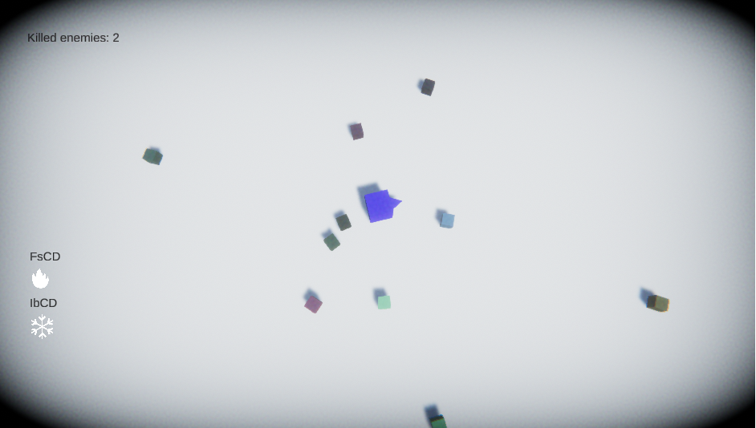
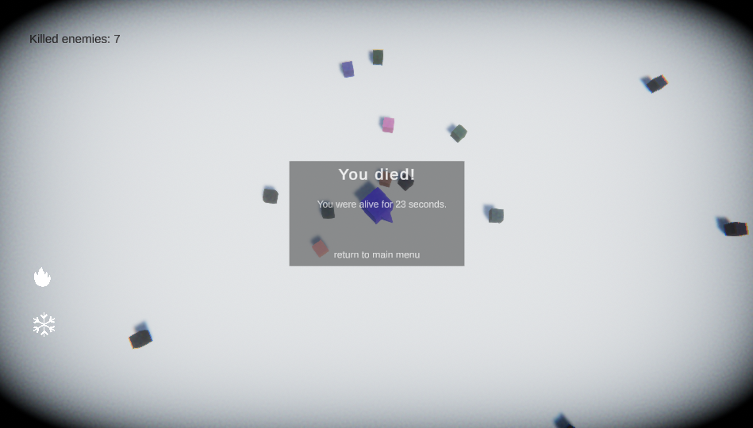

# Zombie Apocalypse

---

### Table of Contents

- [Description](#description)
- [How To Play](#how-to-use)
- [Learned](#learned)
- [Author Info](#author-info)

---

## Description
Trying to defeat as many zombies as possible by shooting and using your spells at them while also trying to stay alive for as long as possible.
    Spells:
        
        Fire strike - Deals 60 dmg (Dmg doesn't stack)
        Ice blast - Slows enemy by 50% for 5 seconds with every hit slow
                    timer resets (Slow % doesn't stack)
        [Invisible so far]

---

## How To Play
> Player always faces the direction of the mouse cursor 

> Press "1" to use "Fire strike" 

> Press "2" to use "Ice blast 

> Press mouse left click to shoot in the direction of the mouse cursor  

---

## Learned 
- Creating and trying to follow naming conventions
- Basic object pooling mechanism
- About Model-View-Controller(pattern)

---

## Author Info

- Twitter - [@MarceliKumiers1](https://twitter.com/MarceliKumiers1)
- LinkedIn - [Marceli Kuśmierski](https://www.linkedin.com/in/marceli-ku%C5%9Bmierski-321969165/)

[Back To The Top](#Zombie-Apocalypse)
